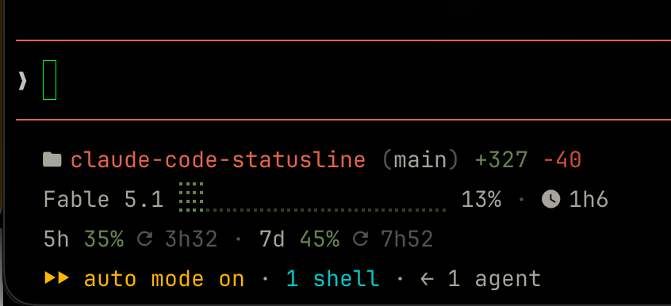

# claude-code-statusline



A Claude Code statusLine script showing project/git context, model/context-window usage,
session duration and rate limits.

## What it shows

Always 3 lines, regardless of whether you're inside tmux:

- **Line 1**: folder icon · project name · `(`branch icon `branch)` (worktree/branch, or plain
  git branch) · `+LOC`/`-LOC`
- **Line 2**: model name · braille context-window bar (⣿ filled / ⣀ empty) · percentage · clock
  icon · session duration
- **Line 3**: 5h usage % · 7d usage %, each with a reset countdown when the payload has one —
  same layout and colors as [tmux-vitals](https://github.com/k8adev/tmux-vitals)'
  Claude segment, minus its leading icon/label. Renders `—` when rate limits aren't in the
  session payload.

## Install

```sh
git clone https://github.com/k8adev/claude-code-statusline ~/Projects/k8adev/claude-code-statusline
```

Then point Claude Code's statusLine at it in `~/.claude/settings.json`:

```json
{
  "statusLine": {
    "type": "command",
    "command": "bash ~/Projects/k8adev/claude-code-statusline/statusline.sh"
  }
}
```

## Requirements

- bash
- jq
- git
- A terminal with truecolor (24-bit color) support
- A [Nerd Font](https://www.nerdfonts.com/) for the icon glyphs

## Icons

Nerd Font Material glyphs, each overridable via a `CLAUDE_STATUSLINE_ICON_*` env var (mirrors
tmux-vitals' `@vitals_icon_*` option pattern):

| Env var | Default | Used for |
|---|---|---|
| `CLAUDE_STATUSLINE_ICON_DIR` | `󰉋` | Project folder (line 1) |
| `CLAUDE_STATUSLINE_ICON_CLOCK` | `󰥔` | Session duration (line 2) |
| `CLAUDE_STATUSLINE_ICON_RESET` | `󰑐` | Rate-limit reset countdown (line 3) |

Line 3 intentionally has no leading Claude icon/label of its own — it's already the statusLine
of a Claude Code session.

## Integration with tmux-vitals

The script writes a rate-limits cache file (JSON with `ts`, `five_hour`, `seven_day`) that
[tmux-vitals](https://github.com/k8adev/tmux-vitals)' Claude segment reads to show usage limits
outside of any active session. Override the cache path with the `CLAUDE_STATUSLINE_RL_CACHE`
env var (default `$HOME/.claude/cache/rate-limits.json`), matching tmux-vitals'
`@vitals_claude_cache` option.

Line 3 is hidden automatically when the session runs inside tmux and tmux-vitals' Claude segment
(`#{vitals_claude}` or `#{vitals_llm}`) is already in the tmux status bar — the same numbers would
otherwise show twice, one line apart. Control it with `CLAUDE_STATUSLINE_LIMITS`:

| Value | Behaviour |
|---|---|
| `auto` (default) | hide inside tmux when tmux-vitals shows the Claude segment, show otherwise |
| `always` | always render line 3 |
| `never` | never render line 3 (two-line statusline) |

## Colors

Anthropic brand palette:

| Name | Hex |
|---|---|
| Clay | `D97757` |
| text secondary | `B0AEA5` |
| muted / separators, reset countdowns | `5E5D59` |
| Olive | `788C5D` |
| Kraft | `D4A27F` |
| Deep | `C6613F` |
| Fig | `C46686` |

Fig is defined as `MAGENTA` but not currently used in output.

### Thresholds

| Meter | Green | Yellow | Red | Override |
|---|---|---|---|---|
| Usage limits (5h / 7d) | up to 50% | 51–80% | 81%+ | `CLAUDE_STATUSLINE_LIMIT_WARN` / `CLAUDE_STATUSLINE_LIMIT_CRIT` |
| Context window | up to 30% | 31–60% | 61%+ | `CLAUDE_STATUSLINE_CTX_WARN` / `CLAUDE_STATUSLINE_CTX_CRIT` |

Context turns yellow early on purpose: Anthropic's [best practices](https://code.claude.com/docs/en/best-practices)
note that performance degrades as the window fills, and `used_percentage` counts input tokens only,
so the real footprint is higher than shown. Usage limits follow a 50-30-20 split; tmux-vitals ships with 60/85, so set `@vitals_warn 50` and
`@vitals_crit 80` there if you want both bars to agree.

## License

MIT © k8adev. See [LICENSE](LICENSE).
